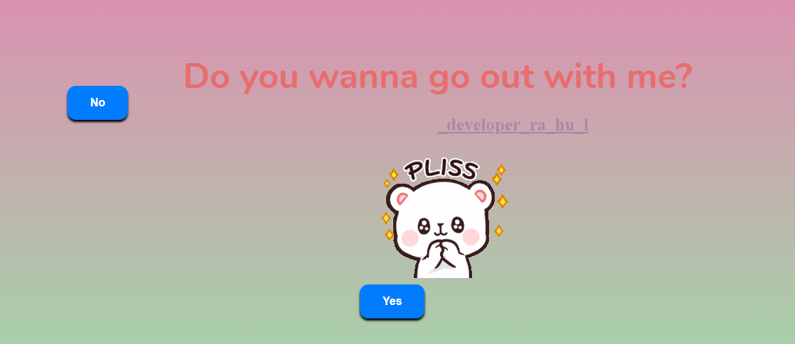

# Asking Your Crush Out for a Date
Ask Your crush for date and she will never reject

This repository contains a website that provides guidance and support for individuals who are considering asking their crush out for a date. The website aims to offer helpful resources and encouragement to those who may be feeling nervous or uncertain about taking this important step.

## Features

- **Interactive Yes/No Answer:** A fun feature where users can input their specific situation and receive a playful "yes" or "no" response, along with a lighthearted message to boost their confidence.

- **Community Support:** A section where users can engage with the community, share their experiences, and seek advice from others who have been in similar situations.

## How to Use

1. Clone the repository to your local machine.
2. Opem index.html file in editor and put your number in this tag ## <button class="btn" id="yesButton" onclick="nextPage()">
           Yes</button> #
        <button
3. Open the index.html in your web browser to access the website.

## Screenshot

## Contributing

Contributions are welcome! If you have additional tips, success stories, or interactive features to add, feel free to fork the repository and submit a pull request.

## License

This project is licensed under the [MIT License](https://opensource.org/licenses/MIT) - see the [LICENSE](LICENSE) file for details.

## Feedback

If you have any feedback or suggestions for improving the website, please open an issue on this repository.

We hope this website brings a smile to your face as you navigate the exciting journey of asking your crush out for a date!
